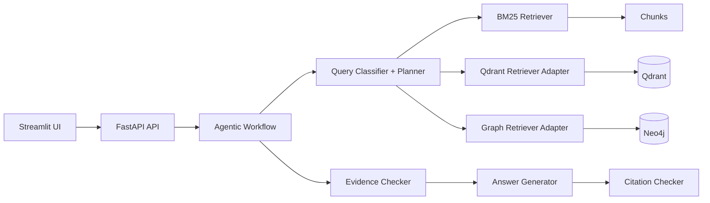
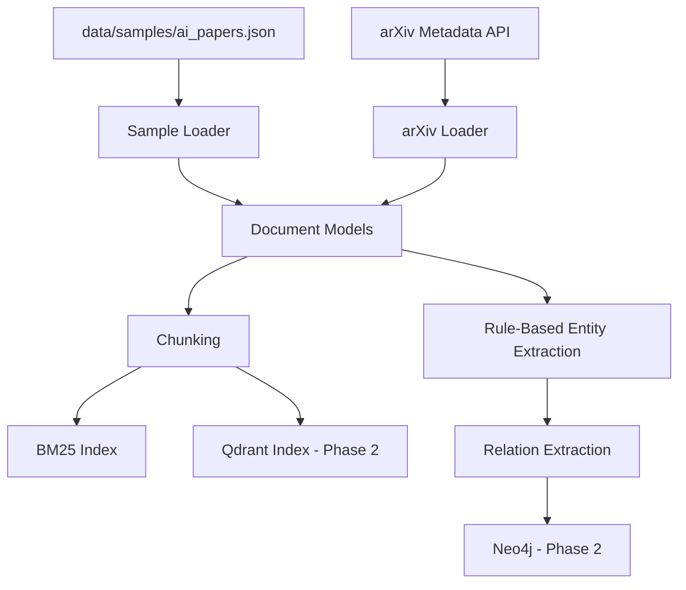
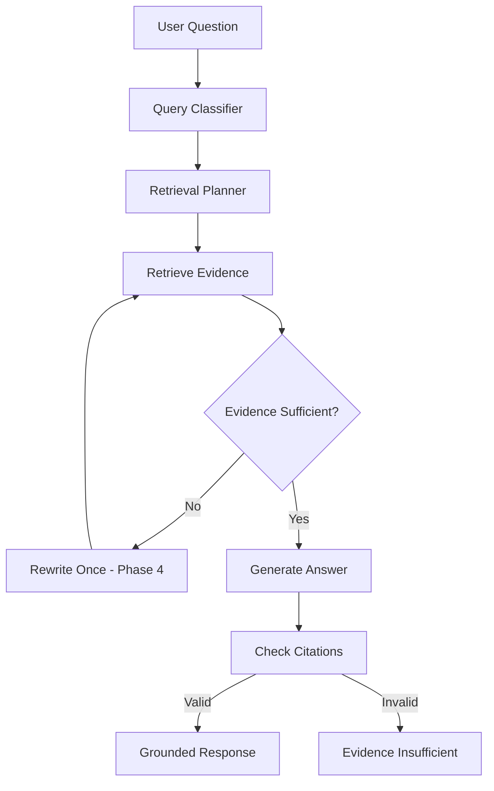

# Domain-Adaptive Agentic GraphRAG Platform

中文名：面向多领域知识库的自适应 Agentic GraphRAG 平台

这是一个可迁移到多领域知识库的 Agentic GraphRAG 项目原型。第一版以 AI Research Papers 为主场景，默认使用 synthetic demo records 和 mock workflow，保证没有 API key、没有模型下载时也能跑通基础流程。

## 为什么不是普通 Chat with PDF Demo

普通 Chat with PDF 通常只做“切分文档 -> 向量检索 -> 让 LLM 回答”。本项目从第一阶段就把工程边界拆开：Domain Schema、BM25、Vector adapter、Graph adapter、Query Planning、Evidence Checking、Citation Checking、Evaluation Dashboard 都有独立模块。第一阶段先跑通骨架，后续阶段逐步接入 SQLite、Qdrant、Neo4j 和真实 embedding。

## 项目亮点

- Domain-Adaptive Schema：领域实体、关系、检索器和评测指标通过 YAML 配置。
- Hybrid Retrieval：已实现 SQLite chunks + BM25 + Qdrant vector search + Neo4j graph retrieval 的合并检索路径。
- GraphRAG：已实现 rule-based entity/relation extractor、Neo4j graph writer 和 graph retriever adapter。
- Agentic Query Planning：已实现 query classifier 和 planner。
- Evidence Verification：已实现最小证据检查。
- Citation Checking：答案引用必须来自 retrieved chunks。
- Evaluation Dashboard：已实现 proxy metrics 和 Streamlit 评测入口。
- Beginner-Friendly：默认 mock/local，避免一开始卡在 API key 或模型下载。
- D Drive First：缓存、数据库、模型、向量库、Neo4j/Qdrant 数据都默认指向 D 盘项目目录。

## 技术栈

- Backend: Python 3.11+, FastAPI, Pydantic, Uvicorn
- Frontend: Streamlit
- Vector DB: Qdrant via Docker Compose
- Graph DB: Neo4j via Docker Compose
- Metadata DB: SQLite first, PostgreSQL-ready repository boundary
- Retrieval: SQLite-backed BM25, Qdrant vector search, Neo4j graph retrieval, simple reranker
- LLM: mock mode now, OpenAI-compatible adapter planned
- Evaluation: proxy metrics now, RAGAS/DeepEval adapter planned

## 系统架构图



## 数据流程图



## Agent Workflow 图



## 目录结构说明

- `app/core/`: document, chunk, schema, embedding, LLM abstractions.
- `app/ingestion/`: sample, arXiv, OpenAlex, Semantic Scholar loaders/adapters.
- `app/retrieval/`: BM25, Qdrant, graph, hybrid retrieval, reranker.
- `app/graph/`: rule-based entity/relation extraction and Neo4j boundary.
- `app/agent/`: classifier, planner, workflow, evidence, answer, citation checks.
- `app/evaluation/`: proxy metrics and sample evaluator.
- `app/api/`: FastAPI routes.
- `app/ui/`: Streamlit app.
- `configs/domains/`: domain schemas.
- `data/samples/`: small committed demo records.
- `data/eval/`: sample evaluation questions.
- `scripts/`: beginner-friendly commands.
- `tests/`: basic regression tests.

## 快速开始

先进入项目目录：

```powershell
cd "D:\codex_project\Domain-Adaptive Agentic GraphRAG Platform"
```

复制环境变量模板：

```powershell
Copy-Item .env.example .env
```

`.env.example` 只包含占位符，不包含真实 API key。不要提交 `.env`。

## C 盘空间不足用户设置指南

推荐把项目、虚拟环境、pip cache、Hugging Face cache、模型缓存、SQLite、Qdrant、Neo4j 数据都放在 D 盘项目目录下。

```powershell
cd "D:\codex_project\Domain-Adaptive Agentic GraphRAG Platform"

python -m venv .venv
.\.venv\Scripts\activate

$env:PIP_CACHE_DIR="D:\codex_project\Domain-Adaptive Agentic GraphRAG Platform\.cache\pip"
$env:HF_HOME="D:\codex_project\Domain-Adaptive Agentic GraphRAG Platform\.cache\huggingface"
$env:TRANSFORMERS_CACHE="D:\codex_project\Domain-Adaptive Agentic GraphRAG Platform\.cache\huggingface\transformers"
$env:SENTENCE_TRANSFORMERS_HOME="D:\codex_project\Domain-Adaptive Agentic GraphRAG Platform\.cache\sentence_transformers"

pip install -r requirements.txt
```

不要提交 `.venv`、`.cache`、`.models`、`data/raw`、`data/cache`、数据库文件、向量库文件。

## Docker Desktop 数据迁移到 D 盘提醒

如果 Docker Desktop 的 WSL2 disk image 还在 C 盘，请手动设置：

```text
Docker Desktop -> Settings -> Resources -> Advanced -> Disk image location -> D:\DockerData
```

本项目的 Qdrant 和 Neo4j 数据目录通过 `docker-compose.yml` 绑定到 D 盘项目目录：

- `data/qdrant_storage`
- `data/neo4j_data`
- `data/neo4j_logs`

## Docker 启动命令

```powershell
docker compose up -d
docker compose ps
```

Qdrant: http://localhost:6333  
Neo4j Browser: http://localhost:7474

默认 Neo4j 密码来自 `.env.example` 的占位符 `please_change_me`。正式使用前请在 `.env` 中改掉。

## 后端启动命令

```powershell
.\.venv\Scripts\activate
uvicorn app.main:app --reload --host 127.0.0.1 --port 8000
```

打开健康检查：

```text
http://127.0.0.1:8000/
```

## 前端启动命令

```powershell
.\.venv\Scripts\activate
streamlit run app/ui/streamlit_app.py
```

Streamlit 的 Ask 页面会调用同一条 hybrid query path，展示答案、query type、evidence 状态、citations、BM25/Qdrant/graph source scores、retrieved chunks 和 graph context。如果 Qdrant 或 Neo4j 没启动，对应分数会降级为 0 或空 graph context，基础问答仍可运行。

Graph 页面会同时展示 entities、relations 表格和一个轻量 Graphviz 图谱视图，方便快速检查样例论文抽取出的知识图谱结构。

## 导入示例数据命令

当前脚本会把 sample documents 和 chunks 写入 SQLite，并尝试把 chunks 写入 Qdrant、把 rule-based entities/relations 写入 Neo4j。如果 Qdrant 或 Neo4j 没启动，脚本会报告 `unavailable`，SQLite 写入仍然成功。

```powershell
python scripts/ingest_sample.py
```

默认 SQLite 路径：

```text
D:\codex_project\Domain-Adaptive Agentic GraphRAG Platform\data\sqlite\app.db
```

如果想让 Qdrant indexing 和 Neo4j graph writing 成功，请先运行：

```powershell
docker compose up -d qdrant neo4j
python scripts/ingest_sample.py
```

示例数据位于 `data/samples/ai_papers.json`。这些记录是 clearly synthetic demo records，`metadata.is_synthetic=true`，只用于演示系统流程。真实论文 metadata 可通过 arXiv loader 获取，默认不会下载 PDF。

## 示例 API 请求

```powershell
Invoke-RestMethod -Method Get -Uri http://127.0.0.1:8000/

Invoke-RestMethod -Method Post -Uri http://127.0.0.1:8000/query `
  -ContentType "application/json" `
  -Body '{"question":"What is Retrieval-Augmented Generation?","domain":"ai_paper","top_k":5}'

Invoke-RestMethod -Method Post -Uri http://127.0.0.1:8000/ingest/sample

Invoke-RestMethod -Method Post -Uri http://127.0.0.1:8000/eval/run
```

`/query` 会优先使用 `data/sqlite/app.db` 中已经导入的 chunks，并尝试合并 Qdrant 和 Neo4j 的结果。如果还没有运行过 `POST /ingest/sample` 或 `python scripts/ingest_sample.py`，它会自动回退到 `data/samples/ai_papers.json`，保证第一次运行也能得到答案。Qdrant 或 Neo4j 没启动时会自动降级，不会影响基础问答。

## 示例问题

- What is Retrieval-Augmented Generation?
- Which papers discuss GraphRAG?
- Compare GraphRAG and standard vector-based RAG.
- Which methods use knowledge graphs for retrieval?
- Which papers are related to agentic RAG?

完整列表在 `data/eval/sample_questions.json`。

## 评测说明

当前评测入口会复用同一条 hybrid query path：SQLite chunks 优先，BM25/Qdrant/Neo4j 自动合并，外部服务不可用时 graceful fallback。Streamlit Evaluation 页面会显示 summary 平均分和 per-question metrics。

第一版实现的是 proxy metrics，不是正式 RAGAS/DeepEval：

- `citation_accuracy`: answer citations 中的 chunk_id 是否来自 retrieved chunks。
- `context_precision_proxy`: retrieved chunks 包含 query keywords 的比例。
- `answer_relevancy_proxy`: answer 和 question 的关键词重合度。
- `faithfulness_proxy`: answer 中关键词能否在 retrieved context 中找到。

后续可替换为 RAGAS / DeepEval adapter。

## 如何迁移到金融年报领域

1. 使用 `configs/domains/financial_report.yaml`。
2. 将 filing metadata 映射到 `Document.metadata`。
3. 增加 Company、Filing、RiskFactor、FinancialMetric 等实体抽取规则。
4. 将 SQLite/Qdrant/Neo4j 中的 `domain` 设置为 `financial_report`。

## 如何迁移到医学文献领域

新增 `configs/domains/biomedical_literature.yaml`，定义 Disease、Drug、Gene、Trial、Outcome、Population 等实体，并替换 loader 和 extractor。不要把 PubMed PDF 或大数据默认下载到 C 盘，原始数据应放到 `data/raw`。

## 如何迁移到法律文档领域

新增 `configs/domains/legal_document.yaml`，定义 Law、Article、Case、Court、Party、Obligation、Exception 等实体。法律场景要更严格地检查 citation，建议把条款编号作为 chunk metadata。

## 简历写法

构建面向多领域知识库的 Agentic GraphRAG 平台，以 AI 论文数据集作为主场景，基于可配置 Domain Schema 抽取 Paper、Method、Dataset、Metric、Task 等实体并构建 Neo4j 知识图谱。系统结合 Qdrant 向量检索、BM25 关键词检索、Graph Retrieval 与 Reranker，实现多文档问答、论文方法对比、技术演化分析和引用溯源。基于 Agentic Workflow 设计 Query Planning、Retrieval Routing、Evidence Verification 与 Citation Checking，并构建评测 Dashboard 量化 context precision、answer relevancy、citation accuracy 与 faithfulness。

## 后续 TODO

- Phase 2: sample/arXiv ingest persistence into SQLite, Qdrant, and Neo4j.
- Phase 3: real hybrid retrieval with Qdrant vector search and graph retrieval.
- Phase 4: query rewrite retry and stronger planner.
- Phase 5: richer FastAPI schemas and service lifecycle.
- Phase 6: graph page now includes table views plus a lightweight Graphviz visualization; future work can add interactive filtering.
- Add OpenAI-compatible LLM client.
- Add sentence-transformers embedding with hashing fallback.
- Add RAGAS/DeepEval adapters.

## 常见问题排查

- `ModuleNotFoundError`: 确认已激活 `.venv` 并运行 `pip install -r requirements.txt`。
- Docker 占用 C 盘：手动把 Docker Desktop disk image location 改到 `D:\DockerData`。
- Neo4j 登录失败：确认 `.env` 中 `NEO4J_USER` 和 `NEO4J_PASSWORD`，并重新 `docker compose up -d`。
- arXiv 请求失败：检查网络，loader 设置了 timeout，且默认不下载 PDF。
- 没有 API key：保持 `LLM_PROVIDER=mock`，第一阶段不需要真实 LLM。

## 运行测试

```powershell
python -m pytest tests -q
python -m compileall app scripts
```
